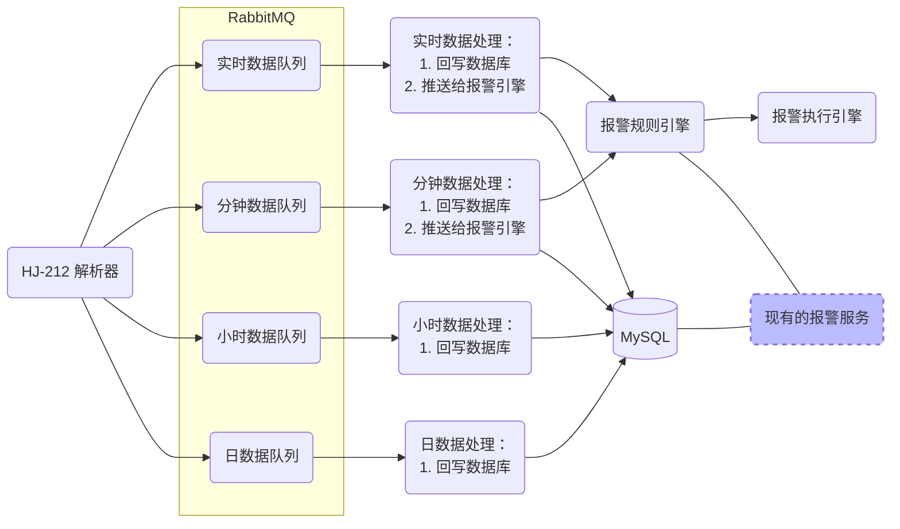
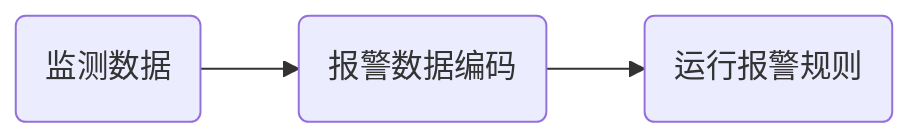

# 君邦环境监测报警引擎


## 系统架构




## 报警规则引擎



### 监测数据格式

**实时数据格式：**

| 序号 | 名称     | 描述                           |
| ---- | -------- | ------------------------------ |
| 1    | mn       | 站点编码                       |
| 2    | datatime | 数据时间                       |
| 3    | code     | 监测因子编码（数采仪原始编码） |
| 4    | value    | 监测值                         |

**分钟数据格式：**

| 序号 | 名称     | 描述                           |
| ---- | -------- | ------------------------------ |
| 1    | mn       | 站点编码                       |
| 2    | datatime | 数据时间                       |
| 3    | code     | 监测因子编码（数采仪原始编码） |
| 4    | min      | 最小值                         |
| 5    | max      | 最大值                         |
| 6    | avg      | 平均值                         |


### 报警数据编码数据结构

```json
{
  "mn-1": {
    "rtValueSameAsPrev": false,
    "minDataOverAlarm": false,
    "minDataOverStandard": false,
    "minDataOutOfRange": false
  }
}
```

